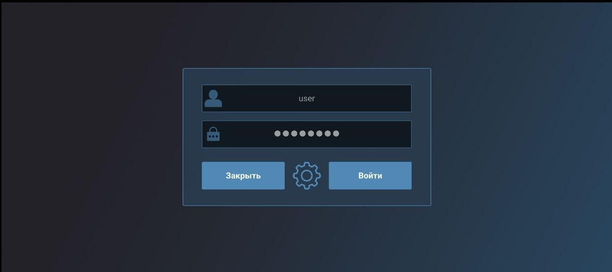
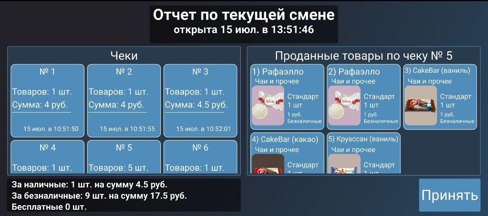
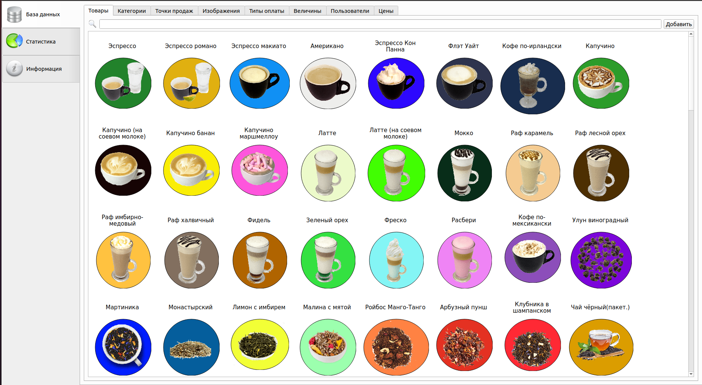
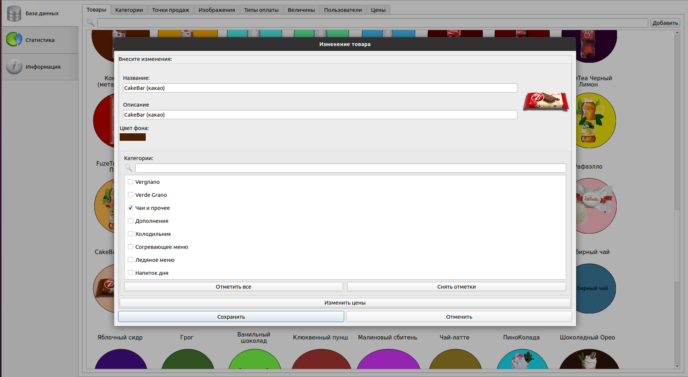
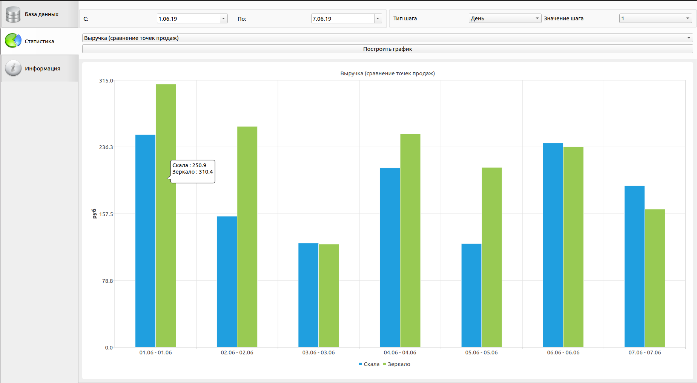

 ## sales-system
 The full program complex consists of: client application for points of sale, client application for director/administrator and server app.
 This system allows you to increase labor productivity and save the company Owner their time and money. 
 
 This is possible thanks to:
- speed up the processing of documents and information;
- reducing the number of manual operations and errors;
- increase reliability;
- improving the quality of tasks performed; 
- etc.

> Полный программный комплекс состоит из: клиентского приложения для точек продаж, клиентского приложения для руководителя предприятия (администратора), серверного приложения.

> Данная система позволит увеличить производительность труда и сэкономить для руководителя компании свое время и деньги. Это станет возможным, благодаря: 
> - ускорению обработки документов и информации; 
> - уменьшению трудозатрат; 
> - повышению достоверности данных; 
> - сокращению количества ручных операций и числа ошибок; 
> - повышению надежности; 
> - повышению качества выполняемых задач.
 
 ## SalesClientQML

 SalesClientQML - Mobile client for points of sale.
 This app was created to simplify the work of the seller, eliminate human errors, speed up the processing of information and facilitate the process of preparing tax and accounting reports.
 
 > SalesClientQML - Мобильный клиент для точек продаж. 
 > Мобильное клиентское приложение предназначено для работы на точках продаж. Данное приложение создано с целью упростить работу продавца, сократить вероятность человеческой ошибки, ускорить обработку информации и облегчить процесс составления налоговых, бухгалтерских отчетов благодаря автоматизации учета проданных товаров.
 
 
 
 
 
 
  ## SalesClientAdmin
 SalesClientAdmin - desktop client for director/owner/administrator. 
 This app was created to simplify edit database and analization statistics data.
 
 > SalesClientAdmin - десктопный клиент для директора/владельца/администратора предприятия.
 Это приложение было создано для упрощения редактирования базы данных и для анализа статистических данных собранных системой.
 
 
 ")
 
 
 
