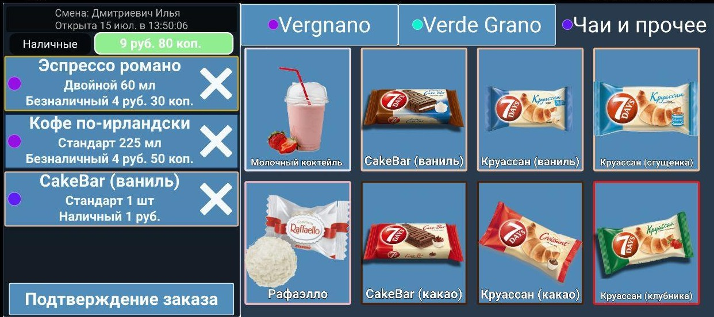
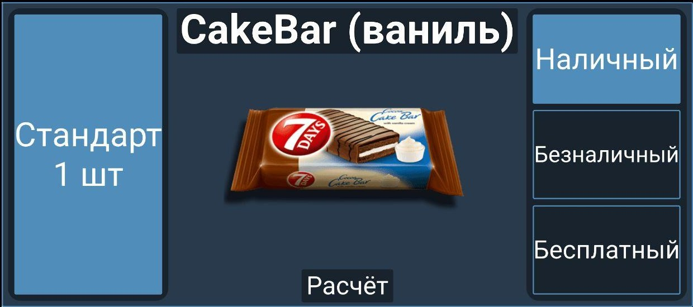

 ## sales-system
 The full program complex consists of: client application for points of sale, client application for owner/director/administrator and server app.
 This system allows you to increase work productivity and save time and money for company owner/director. 

> Полный программный комплекс состоит из: клиентского приложения для точек продаж, клиентского приложения для руководителя предприятия (администратора), серверного приложения.
 
 ## SalesClientQML

 SalesClientQML - mobile client for points of sale.
 This app was created to simplify the work of the seller, eliminate human errors, speed up the processing of information, facilitate the process of preparing tax and accounting reports.
 
 > SalesClientQML - мобильный клиент для точек продаж. 
 > Мобильное клиентское приложение предназначено для работы на точках продаж. Данное приложение создано с целью упростить работу продавца, сократить вероятность человеческой ошибки, ускорить обработку информации и облегчить процесс составления налоговых, бухгалтерских отчетов благодаря автоматизации учета проданных товаров.
 
 
 
 
 
 
  ## SalesClientAdmin
 SalesClientAdmin - desktop client for director/owner/administrator. 
 This app was created to simplify edit database and analization statistics data.
 
 > SalesClientAdmin - десктопный клиент для директора/владельца/администратора предприятия.
 Это приложение было создано для упрощения редактирования базы данных и для анализа статистических данных собранных системой.
 
 
 ")
 
 
 
